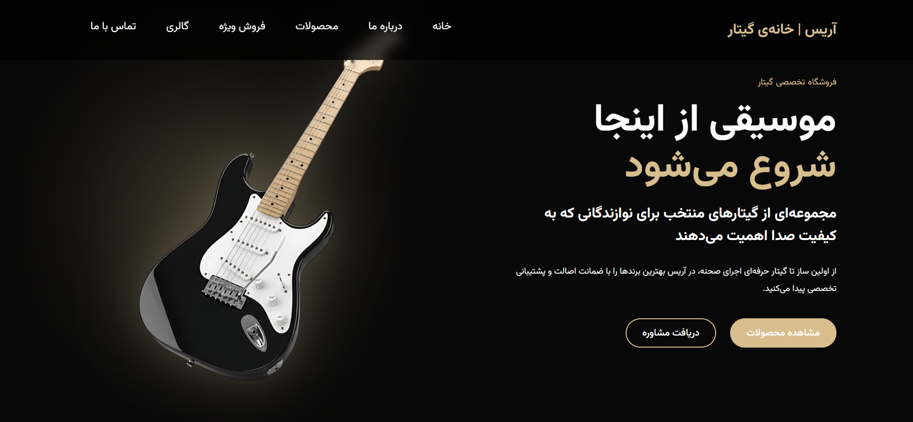

 Aris Guitar Shop
 
A modern and responsive guitar shop landing page built with HTML, CSS and JavaScript.

Preview

Live Demo

https://mehraneh-aris.github.io/aris-guitar-shop/

Technologies

- HTML5
- CSS3
- JavaScript

Features

- Responsive Design
- Modern User Interface
- Clean Layout
- Smooth Navigation

 What I Learned

- Building responsive layouts with CSS.
- Using Flexbox and Grid.
- Organizing project files.
- Working with Git and GitHub.
- Deploying a website with GitHub Pages.

